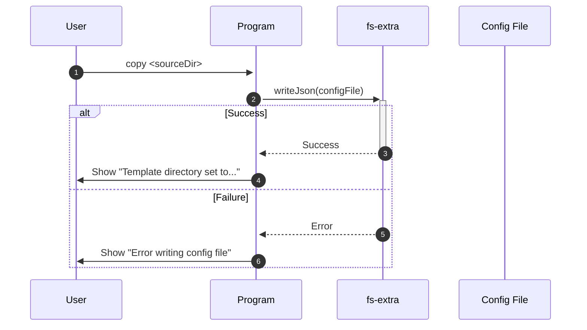
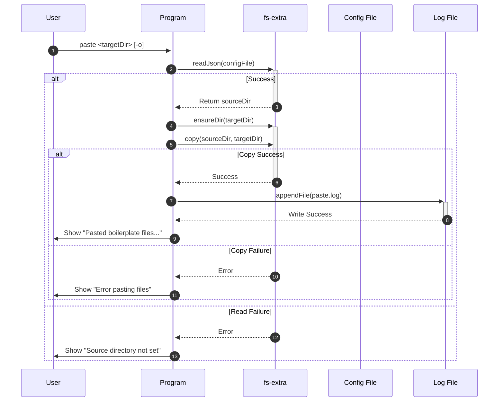
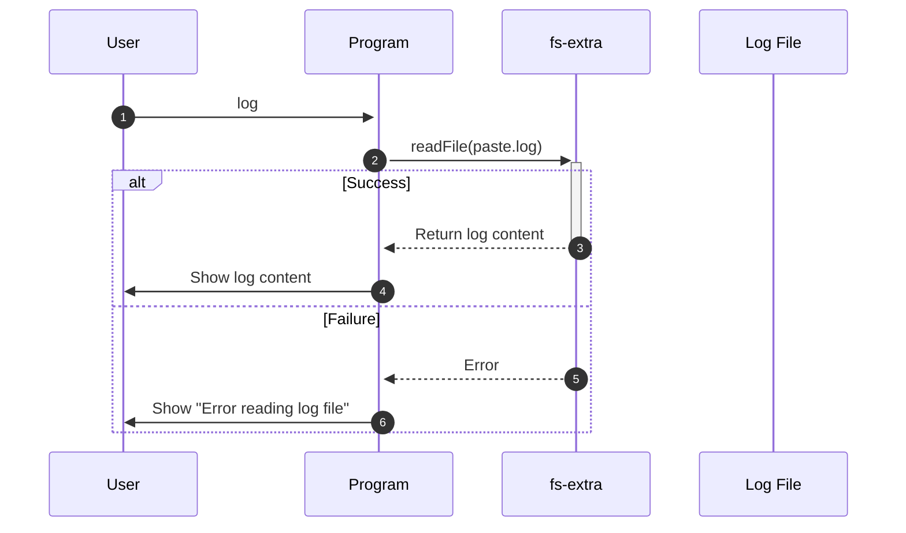

# Boilerplate Copier

Boilerplate Copier is a powerful tool for copying and pasting boilerplate files, suitable for various scenarios that require reusing code snippets. It can help you break free from tedious copy-paste work and improve development efficiency.

[简体中文](./README.zh-CN.md)

## Features

- Simple and easy-to-use command-line interface
- Support for setting the source directory of boilerplate files
- Quickly paste boilerplate files to the target directory
- Option to overwrite existing files
- Easy to extend and customize
- Support for viewing paste logs, making it convenient to track file paste history

## Installation

Global installation:

```bash
npm install -g boilerplate-copier
```

## Usage

1. Use the `copy` command to set the source directory for boilerplate files:

   ```bash
   copier copy <sourceDir>
   ```

2. Use the `paste` command to paste boilerplate files to the target directory:

   ```bash
   copier paste <targetDir>
   ```

   Use the `--overwrite` option to overwrite existing files.

3. Use the `log` command to view paste logs:

   ```bash
   copier log
   ```

   This command will display recent paste operation records, including source directory, target directory, and paste time.

## Development Guide

1. Clone this repository:

   ```
   git clone https://github.com/Gijela/Boilerplate-Copier.git
   ```

2. Install dependencies:

   ```
   cd boilerplate-copier
   npm install
   ```

3. Modify `index.js` and `config.json` files as needed to suit your project requirements.

4. Run the following commands for testing:

   ```
   node index.js copy /path/to/your/boilerplate
   node index.js paste /path/to/your/project
   node index.js log
   ```

5. Pull requests are welcome! Contribute your ideas and improvements!

## Sequence Diagrams

1. copy command



2. paste command



3. log command



## License

This project is released under the [MIT License](./LICENSE). Feel free to use, modify, and distribute.

## Contact

If you have any questions or suggestions, please contact us through [GitHub Issues](https://github.com/Gijela/Boilerplate-Copier/issues).
